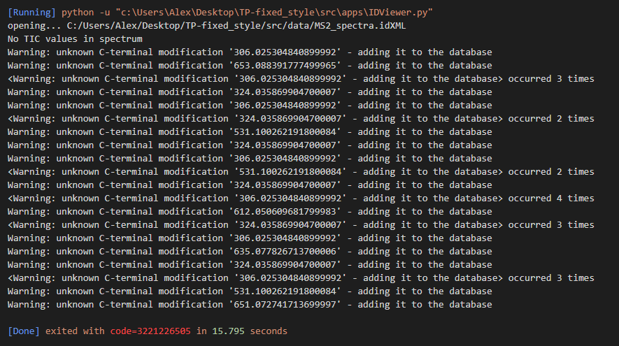

# Woche 3 

**Aufgabe 1** 
Hat so weit alles funktioniert, es fehlen allerdings Dateien im erstellten build Ordner. Es wurden nämlich nur .py Dateien mitgenommen, und ich gehe davon aus, dass man doch alle am Ende benötigt für ein funktionierendes package. Konnte allerdings selbst mit Anpassung der __init__.py nicht erreichen, dass auch andere Dateitypen mitgenommen wurden. 

**Aufgabe 2**

**Aufgabe 3**

**Aufgabe 4**
Fehler bei Alex über die Console: ModuleNotFoundError: No module named 'ControllerWidget'

Wenn ich(Alex) über VS Code gehe, dann läuft es, aber wenn ich ein das XML file öffnen will, dann crashed das Programm ohne wirkliche Fehlermeldung. Nach dem Ausbessern des Codes (Aufgabe 2) und erneutem probieren funktioniert es noch immer nicht, gibt aber jetzt diese Fehlermeldung aus: 

