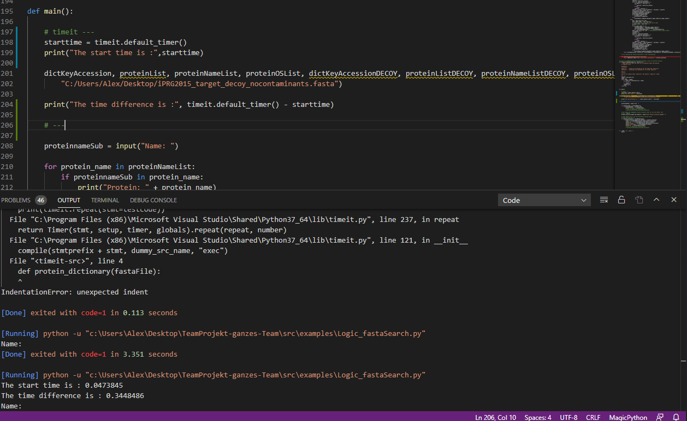
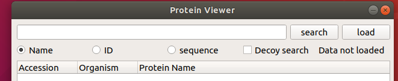

# Woche 10

## ProteomicsLFQ

* Es wurde eine neue Klasse definiert "ProteomicsLFQ_command". In diese Klasse wird ProteomicsLFQ in der Konsole ausgeführt mit den vorgegebenen Daten in den neuen Ordner FRACTIONS. Als Ausgabe gibt es die Informationen auf der Konsole und 3 Dateien. Zu der GUI wurde ein neuer Ladeknopf hinzugefügt. Sobald dieser gedrückt wird, kann man die Informationen von ProteomicsLFQ in der Gui auf dem Tab PSM/Protein Viewer ansehen. 
Es gab Schwierigkeiten bei der Bonus Aufgabe, weil unsere Gruppe kein Zugang zu der pyopenms Dokumentation hatte und somit könnten wir nicht die Dateien, die durch ProteomicsLFQ entstanden sind, bearbeiten bzw nicht die gewünschte Information raus holen.

# Woche 9

## Refactoring
* Methoden und Klassen wurden umbennant. Code wurde angepasst und es konnten mehrere hundert Zeilen Code entfernt werden, ohne das externe Verhalten zu
beeinflussen.
* Das Widget ist nun in der Größe veränderbar.

## Tab-Widget
* Merge branch master (auf aktuellen Stand gebracht)
* Die Dateien der anderen Teams wurden entweder vom aktualisierten master und/ oder von den repos der anderen Teams gezogen und auf unseren neu erstellen branch für das Tab-Widget rein kopiert.

### Problem mit Widget Gruppe 3
* Beim Ausführen des Widgets von Team 3 kam ein "index out of range" Fehler.
* Das einfügen des Widgets von Team 3 funktionierte ebenso wenig auf grund des Errors.

# Woche 8

## Aufarbeitung von Rückständen
* Das Problem des sehr langen ladens und möglichen aufhängens des Protein Viewers
bei einer Ausgabe von sehr vielen Proteinen wurde gelöst. Jedes TreeItem mit Proteine Accsession, organismus und Name kann angeklickt werden. Erst durch dieses Signal werden dem Item zwei neue, untergeordnete TreeItemes erstellt welche die Proteinsequenz und den Link zur Datanbank UniProt enthalten.(Caro)

## Pull Request auf das Mainrepository
* Nahezu alle "Fehler" bzw. typos und ähmliches wurden inzwischen beseitigt. Einer der Vorschläge war den Code durch regular expressions zu verkürzen.
Hier kommt es momentan allerdings noch zu einem etwas ungewöhnlichen Fehler, sodass dies noch nicht implementiert wurde.
Es entstehen nämlich weitaus mehr Einträge in der Liste (ist: 59 Einträge) als es der Fall sein sollten (soll: 2 Einträge).

## Hauptapplikation
* Es wurde ein erstes TabWidget erstellt, welches im Moment nur den eigenen Protein Viewer enthält.(Caro)

# Woche 7
## Screenshots zu Debugging und timeit

## Anwendungsbereiche Debugging
* Wie es der Name schon sagt, nutzt man es um Fehler zu finden und somit beseitigen zu können. Da man sich an laufende Prozesse ran hängen kann, sieht man so, wo die Fehler passieren. Zudem ist es mit breakpoints an den richtigen Stellen möglich genau verfolgen zu können in welcher Reihenfolge der Code durchlaufen wird. Auch damit lassen sich Fehler finden und Optimierungen werden einfacher möglich.

* Stacktrace:
Beschreibt zum debuggen im Prinzip wo sich das Programm zuletzt aufgehalten hatte als es zum Fehler kam.

## Team 1 - Aufgabe der Woche 7 (Implementiert ein Feature, dass beim Klicken auf eine Protein ID (z.B. Q9UPY3) weitere Informationen im default OS-Browser darstellt / aufruft.)

Die Aufgabe wurde erfüllt in dem das GUI mit QTextBrowser erweitert wurde. Das QTextBrowser wurde mit dem QTextEdit verbunden und mit dem Befehl .insertHtml wurde der Link mit der Accsession Nummer zu jedem Protein in der Schleife hinzugefügt.(Hristian)

Diese Implementierung verursacht einen Fehler. Als Rückgabe wird "Segmentation  fault (core dumped)" zurückgegeben. Wir haben versucht das Stacklimit auf erhöhen aber der Fehler ist trotzdem aufgetreten.

Zusätzlich wurde das QTreewidget mit einer Soritierungs Option erweitert. Der Befehl der benutzt wurde ist "setSortingEnabled(True)" das QTreeWidget hat einen eigenen Algorithmus für die Sortierung.(Hristian)

# Woche 6
## Veränderung am GUI
* Es wurde ein Label hinzugefügt, welches anzeigt ob eine Datei geladen ist. (Hrisitan)

* GUI wurde in drei Methoden umgeschrieben, entsprechend welche Auswahl getroffen wurde für die Suche. Für sowohl bessere Lesbarkeit des Codes wie auch darauf folgend besseres Debugging(Hrisitan).

* Die Darstellung der Daten im Treewidget wurde verändert. Wird über die ID, den Namen oder einem Peptid gesucht, werden die Ergebnisse der Suche jetzt tabellarisch dargestellt und für jedes Protein wird die ID, der Organismus und der Name des Proteins ausgegeben. Die jeweilige Protein Sequenz wird ausgeklappt(Caro).

* Sobald eine Datei geladen wird verändert sich das Label zu "Data loaded" und es werden alle Proteine angezeigt die in der Datei enthalten sind. Jedoch wird nur die ID, der Organismus und der Name des Proteins dargestellt nicht aber die jeweilige Sequenz(Caro). Das zusätzliche Laden der Sequenzen führte dazu, das sich die UI aufhing. Es wurde versucht dieses Problem über asyncio zu beheben jedoch hat dies nach mehreren Versuchen nicht funktioniert und es wurde dann auf die Ausgabe der Sequenzen verzichtet(Alex,Hristian).

## Code Dokumentation
* Der Code der GUI wurde nach dem NumPy/SciPy Standard Dokumentiert und Kommentiert() und es wurde ein Type Hint hinzugefügt(Hrisitan).  

## Veränderungen an der Logik
* Die Logik wurde überarbeitet da es Probleme gab die Decoy Sequenzen richtig auszugeben. Das Problem wurde behoben in dem es nun extra Listen für diese Sequenzen gibt und sie somit sauber von den anderen Sequenzen getrennt sind(Alex).

* Es ist uns aufgefallen das die Logik noch einen größeren Fehler aufwies, der jedoch nur Sichtbar wurde bei Proteinen die weiter unten im Fasta fiel gelistet waren. Die ersten Proteine aus der Datei wurden richtig ausgegeben, bei anderen wurden die IDs falschen Namen und Sequenzen zugeordnet. Das Problem lag daran, dass es Proteine in der Datei gibt, deren Kopfzeilen nicht dem Standart entsprechen zb. werden sie nicht mit **I** getrennt und enthalten auch keine ID. Dies Proteine wurden erst Umgangen aber die Position wo man sich in der Datei befindet wurde nicht verändert und dadurch verschoben sich die Informationen.

* Das Problem wurde vorläufig behoben, indem diese Proteine berücksichtigt werden und die Kopfzeile etwas anders ausgelesen wird, unabhäning von einer Trennung durch **|**.
Für diese nicht allzu häufig vorkommenden Proteine wird der Proteinname auch als ID gespeichert. Diese Lösung wird vorraussichtlich noch verbessert(Caro).

## Bugs
* Wir beobachteten unterschiede im verhalten der GUI bei Windows und Ubuntu. Ist man dabei eine Datei zu laden und bricht dies aber ab, schließt sich das Fenster in Windows jedoch bei Ubuntu nicht.
* Sobald die Suche sehr unspezifisch wird und theoretisch jedes Protein ausgegeben wird, hängt sich das GUI auf im schlimmsten Fall oder es dauert sehr lange.

# Woche 4-5 (über Pfingsten)

Das repo wurde auf dem master branch bereinigt und auf den Stand vom 15. Mai zurückgesetzt, sodass es updates vom master:pyopenms-extra entgegen nehmen kann.

## Die Gruppe hatte die Aufgabe 1 zu erledigen

## Aufgabe 1
Hristian hat das Hauptgerüst des Mainwindows und das Layout erstellt. Danach wurden von ihm searchbars und buttons erstellt. Die Buttons wurden verbunden und implementiert mit die jeweiligen Funktionen aus der logic Datei die Alex erstellt hat. Das Layout wurde mehrmals angepsst, weil die Gruppe in laufe der 2 Wochen das Design immer wieder verbessert hat. Die ursprüngliche Idee war, die gesuchten Proteine in eine Tabelle zu zeigen. Dem entschprechend wurde am Anfang ein QGridLayout benutzt. Nach dem Vorlschalg von den Tutoren wurde das Design verändert und die Tabelle wurde ersetzt durch ein Treeview der von Caro implementiert wurde. Hristian hat das Layout auf eine QVBoxLayout geändert der zusätzlich 3 QHBoxLayouts enthält. Somit wurde eine strukturiertes Aussehen ereicht. Die Tutoren haben ebenso vorgeschlagen eine dynamische Suche zu implementieren. Das bedeutet das man auch Präfixe von Protein Accessions als Eingabe für eine Suche benutzen kann und alle Proteine zeigt die diese Präfixe haben. Nach dem Alex die Funktionen in der Logic angepasst hat wurden sie von Hristian in das UI implementiert und das Treeview wurde mit eine for Schleife erweitert. Somit werden jetzt alle Proteine in dem Fenster angezeigt.  
## Aufgabe 2
Bei diese Aufgabe hat sich die Gruppe entschieden Radiobuttons zu benutzen die jeweils eine Input-Möglichkeit darstellen. Die 3 Möglichkeiten sind ID(Protein accession) Sequenz und Proteinname. Zusätlich wurde ein Chekbox hinzugefügt, die es ermöglicht nach den Decoy Proteine zu suchen. Diese kann an und ausgemacht werden. Die Radiobuttons und die Checkbox wurden von Hristian implementiert. Zusätzlich wurden von Hrisitan Error Messages implmentiert für flasches Eingaben oder für gar keine Eingaben sowie ein Load button und eine load Funktion mit der man die Datei auswählen kann und der Pfad dazu kopiert wird.

## Aufgabe 3
...
Bei diese Aufgabe hat die Gruppe die meisten Schwierigkeiten. Die Idee ist gesuchte Sequenz-Teile in der Ausgabe zu markieren(z.B durch Farbe) und zusätzlich sollte es möglich sein mit der Maus teile aus der Squenz zu markieren und zu Färben. Dabei waren die 2 Hauptprobleme
1. Die markierte Stelle in der Sqeuenz als information im Code zu bekommen
2. Die Strings zu färben, es wurde zum Zeitpunkt dieser Dokumentation keine funktion gefunden , die die Strings färben kann
Das 2 Problem wurde von Caro und Hristian gelöst. Die Ausgabe wird nun nicht mehr über QPlainTextedit gemacht sondern mit QTextEdit. QTextEdit hat die Methode .SetTextColot die QColor als Argument bekommt und die Textfarbe von den nächsten hinzugefügten String ändert. Somit wurde das GUI um ein weiteres Feature erweitert indem die gesuchte Proteinsequenz in der Ausgabe rot markiert wird.

# Woche 3

## Github io page
Die io page läuft nun nicht mehr über den master branch und die README, sonder es wurde ein neuer branch gh-pages erstellt und die Datei index.md wird für die Dokumentation genutz. Da das repository schon einen docs Ordner auf dem master branch besitzt wurde die variante mit dem neuen branch gewählt.

## Aufgabe 1
Hat so weit alles funktioniert, es fehlen allerdings Dateien im erstellten build Ordner. Es wurden nämlich nur .py Dateien mitgenommen, und ich gehe davon aus, dass man doch alle am Ende benötigt für ein funktionierendes package. Konnte allerdings selbst mit unterschiedlichesten Herangehensweisen der Anpassung der __init__.py nicht erreichen, dass auch andere Dateitypen mitgenommen wurden.

## Aufgabe 2
Hristian hat die Aufgabe bekommen nach geeignete tools im Internet zu suchen. Das Team hat sich für autopep8 entschieden, weil es den Code auf PEP8 Standard formatiert und es für Atom und VS Code verfügbar ist. Mit Autopep8 wurden die meisten "Violations" auf der Pipeline behoben. Die häufigsten "Violations" waren "missing Whitespaces" und "line too long". Die "line too long" Violations wurden mit black behoben. Black verfügt über den Befehl black -l length. Der Integer der für "lenght" angegeben wird bestimmt wie Lange die Zeilen im Code sein dürfen. Somit wurde die Zeilen länge auf 79 gebracht um das flake8 test zu erfüllen. An einige Stellen im Code gab es länger Kommentar-Blöcke die lediglich den Code erklärt haben. Diese Blöcke die Funktionalität des Codes nicht verändern und um eine gute Lesbarkeit der Kommentare zu erlauben haben wir die Blöcke mit den befehl #noqa: markiert damit flake8 sie beim Testen ignoriert. Bei der Aufgabe hat sich später eine kleine Schwierigkeit ergeben. Als das Team die Aufgabe 4 bearbeitet hat gab es bei Hristian einen Fehler und er könnte die IDViewer.py Datei nicht ausühren. Hristian hat herausgefunden, dass autopep8 einen bug hat der die Import reihenfolge manchmal verändert. Dieses Bug wurde mit dem Kommentar  # NOQA: E402 behoben.

## Aufgabe 3
PR gegen das upstream pyopenms-extra repository

## Aufgabe 4
Fehler bei Alex über die Console: ModuleNotFoundError: No module named 'ControllerWidget'

Wenn ich(Alex) über VS Code gehe, dann läuft es, aber wenn ich ein das XML file öffnen will, dann crashed das Programm ohne wirkliche Fehlermeldung. Nach dem Ausbessern des Codes (Aufgabe 2) und erneutem probieren funktioniert es noch immer nicht, gibt aber jetzt diese Fehlermeldung aus:

Beispiel Tabelle Hristian:

Hristians Lösung war, nach den Vorschlag von Caro, in der Datei ControllerWidget.py eine Methode creatingTables() zu schreiben. Die Methode benutzt QTableWidget um eine Tabelle zu erstellen. Mit .setRowsCount() und .setColumnCount() wurde die Anzahl and Spalten und Zeilen gesetz. Danach wurde die Tabelle zum Layout hinzugefügt und die Methode unter der Loadfile funktion geschrieben. Damit die Tabelle erst bei der Ladung von witere Daten zu zeigen. Da die Tabelle noch keine Sinvolle Daten haben soll wurde nichts mehr beim Laden verändert.

**Caro**

Bei laden der Daten wurde folgende Fehlermeldung genereiert und es wurden keine Spektren angezeig. Der fehler konnte leider nicht behoben werden.

Des weiteren konnte eine weitere Tabelle hinzugefügt werden. Dafür wurde eine eine Datei TestTabel.py im ordner view erstellt und diese im ControllerWidget importiert und über der vorhanden Tabelle hinzugefügt.

